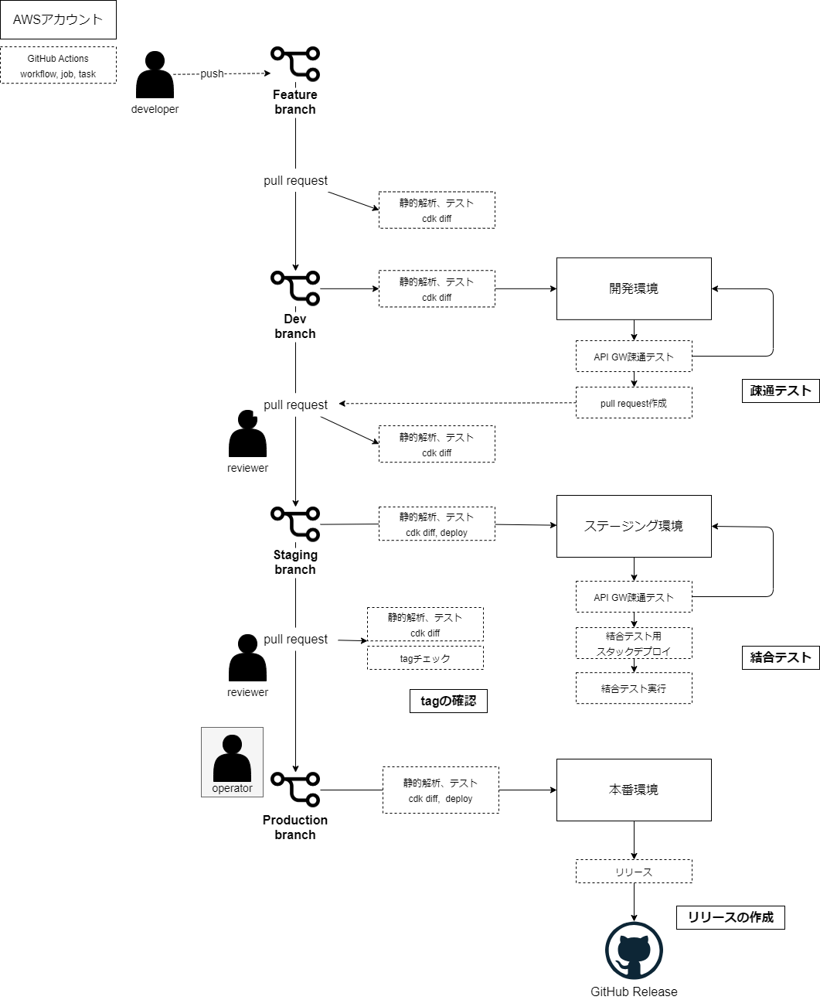
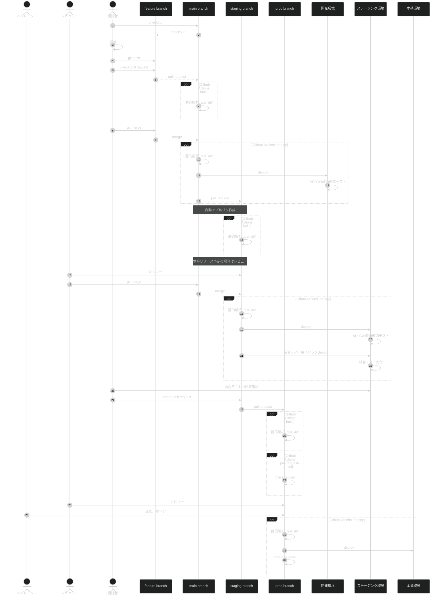
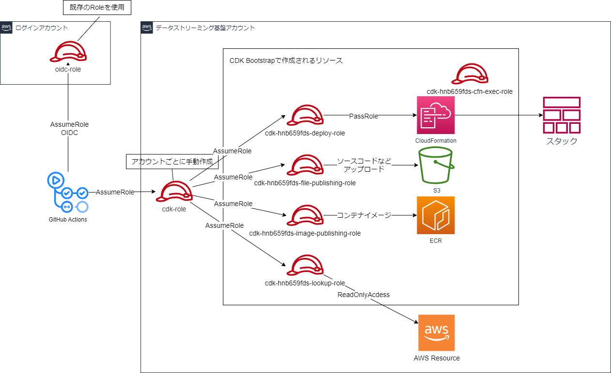
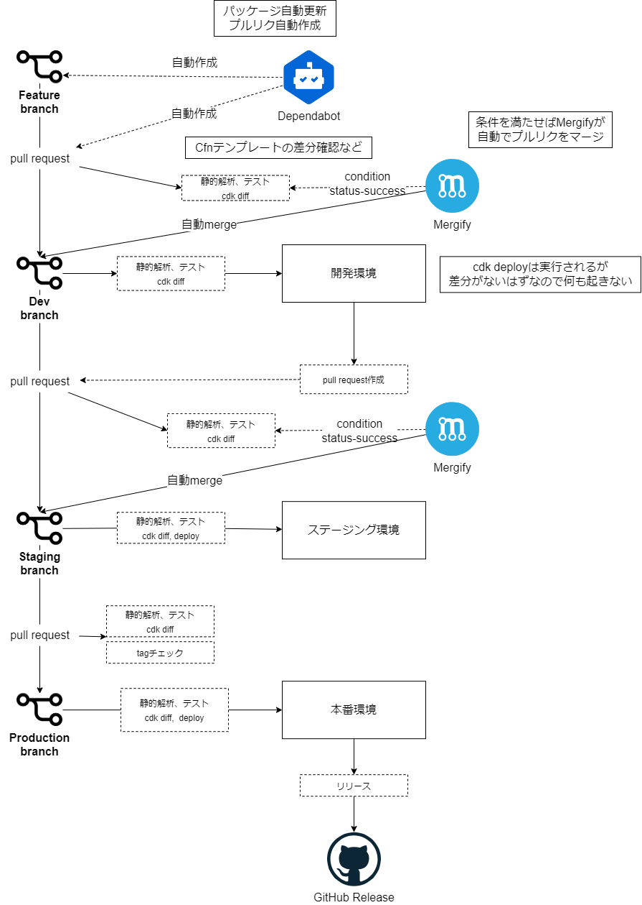

# データストリーミング基盤CI/CD <!-- omit in toc -->

## 目次 <!-- omit in toc -->

- [概要](#概要)
  - [CI/CD設計のポイント](#cicd設計のポイント)
  - [全体構成](#全体構成)
- [ブランチ戦略の選定](#ブランチ戦略の選定)
- [開発の流れ](#開発の流れ)
- [静的解析一覧](#静的解析一覧)
- [実施テスト一覧](#実施テスト一覧)
- [WorkFlow一覧](#workflow一覧)
- [AWSデプロイ時のRole](#awsデプロイ時のrole)
  - [概要](#概要-1)
  - [CDKデプロイ用Roleの作成](#cdkデプロイ用roleの作成)
- [パッケージの自動更新運用](#パッケージの自動更新運用)
  - [概要](#概要-2)
  - [設定ファイル](#設定ファイル)

## 概要

### CI/CD設計のポイント

- 環境
  - デプロイ先AWS環境は開発、ステージング、本番の3環境
  - 開発環境: リリースのための開発だけでなく、新サービスの調査などにも利用
  - ステージング環境: 本番リリースに向けた結合テスト環境として利用
- リリース頻度
  - 週１回もない想定
- 開発規模
  - IaCで、開発対象はKDSとその周辺のみのためコード量は少なめ
  - 開発人数は1 ~ 2人想定

### 全体構成



## ブランチ戦略の選定

- GitLab FlowのEnvironment branchesを採用
- ブランチ名は独自に変更

[Environment branches with GitLab flow](https://docs.gitlab.co.jp/ee/topics/gitlab_flow.html#environment-branches-with-gitlab-flow)

<details><summary>GitLab Flowを選択した理由</summary>

- Git Flowは大規模開発向けで必要以上に複雑になってしまうため、検討対象から除外
- 本番リリースは、オペレータにてプルリクを承認しマージすることで行う。そのため本番リリースブランチがないGitHub Flowは選択肢から除外
- デプロイ先環境ごとに対応ブランチを作成するGitLab Flowを採用、IaCとの相性が良いと判断

</details>

## 開発の流れ



## 静的解析一覧

| チェック項目         | 実行タイミング                                 | ツール名              | 詳細                                                          |
|----------------|-----------------------------------------|-------------------|-------------------------------------------------------------|
| コードフォーマット      | commit時、プルリク作成、push時                    | Prettier          | markdown, typescriptのフォーマット                                  |
| コードリンター        | commit時、プルリク作成、push時                    | ESLint            | CDKコードチェック                                                  |
| markdownリンター   | commit時                                 | markdownlint-cli2 | markdownコードチェック                                             |
| コミットリント        | commit時                                 | commitlint        | Git のコミット規約（commit convention）に従わせるための npm ツール              |
| dependencyチェック | commit時、プルリク作成、push時                    | depcheck          | npmパッケージの依存関係チェック                                           |
| cdkセキュリティチェック  | プルリク作成、push時<br/>(cdk diffやsynth実行時に起動) | cdk-nag           | cdkのコードがAWSのセキュリティベストプラクティスに沿っているかをデプロイ前にチェックする             |
| Lambda関数脆弱性診断  | push時                                   | checkmarx         | Lambda関数の中身の実装はcdk-nagのスコープ外のため、この部分についてはcheckmarxで脆弱性診断を行う |

## 実施テスト一覧

| テスト名                    | 実行タイミング       | ツール名         | テスト内容                                                                                                              | 用途                             | エラー時の対応                                                    |
|-------------------------|---------------|--------------|--------------------------------------------------------------------------------------------------------------------|--------------------------------|------------------------------------------------------------|
| snapshot testing        | プルリク作成、push時  | aws-cdk/jest | 現在ノードから生成されるCfnテンプレートと過去のスナップショットを比較し、変更がないかをテストする。<br/>差分があった場合、テストは失敗する。                                              | パッケージの更新、リファクタリング              | 意図した差分の場合、ローカルでスナップショットを更新する<br/>意図しない差分の場合、内容を確認しコードを修正する |
| Fine-grained Assertions | プルリク作成、push時  | aws-cdk/jest | 生成されるCfnテンプレートのリソース設定値が、期待した値になっていることを確認するテスト。                                                                     | セキュリティテスト                      | cdkコードを修正する                                                |
| APIGW疎通確認テスト            | デプロイ時         | AWS CLI      | AWS CLIでAPI GWの疎通確認テストを実行する                                                                                        | APIGWを使用する構成のテスト               | エラーを修正して再デプロイする                                            |
| 内部結合テスト                 | ステージング環境デプロイ時 |              | ステージング環境で内部結合テスト用のスタックをデプロイする。Producerの代用としてCodeBuildをVPC内で起動し、API GWやKDSに対してデータを送信し、Consumerサービスで正常に処理されることを確認する。 | データストリーミング基盤単体で実施するリリース前の確認テスト | エラーを修正して再デプロイする                                            |

## WorkFlow一覧

| ワークフロー名               | トリガー                                              | 概要                                                    | 詳細                                                                                                                                   |
|-----------------------|---------------------------------------------------|-------------------------------------------------------|--------------------------------------------------------------------------------------------------------------------------------------|
| build/action.yml      | composite action                                  | 静的解析、パッケージの依存関係チェック、<br/>既存環境への影響確認、セキュリティテスト、diffの確認 | eslint, depcheck, snapshot testing, fine-grained assetions, cdk diff                                                                 |
| access/action.yml     | composite action                                  | AWSへのアクセス権限の取得                                        | aws-actions/configure-aws-credentials                                                                                                |
| build.yml             | pull_request_target<br/>workflow_dispatch         | プルリク作成時に静的解析や差分確認を実施                                  | access/action.yml呼び出し<br/>build/action.yml呼び出し                                                                                       |
| pull-request-lint.yml | pull_request_target(prodのみ)<br/>workflow_dispatch | 本番リリースのプルリクのチェック                                      | tagの付与チェック                                                                                                                           |
| dev-deploy.yml        | push(mainブランチ)                                    | 開発環境へのデプロイ                                            | access/action.yml呼び出し<br/>build/action.yml呼び出し<br/>cdk deploy "dev/*"<br/>API GW疎通確認テスト<br/>pull request作成                           |
| staging-deploy.yml    | push(stagingブランチ)                                 | ステージング環境へのデプロイ                                        | access/action.yml呼び出し<br/>build/action.yml呼び出し<br/>cdk deploy "staging/*"<br/>API GW疎通確認テスト<br/>cdk deploy "integtest/*"<br/>結合テスト実行 |
| prod-deploy.yml       | push(prodブランチ)                                    | 本番環境へのデプロイ                                            | access/action.yml呼び出し<br/>build/action.yml呼び出し<br/>cdk deploy "prod/*"<br/>リリースの作成                                                   |
| init.yml              | workflow_dispatch                                 | 初期構築用ワークフロー<br/>各環境共通                                 | access/action.yml呼び出し<br/>cdk bootstrap                                                                                              |                                                               |


## AWSデプロイ時のRole

### 概要



- OIDCでログインアカウント内のRoleをAssumeRoleする
- その状態でデータストリーミング基盤アカウント内に作成したCDKデプロイ用Role(cdk-role)をAssumeRoleする
- CDKデプロイ用Roleは、cdk bootstrap時に作成されるcdk-hnb659fds-*-roleをAssumeRoleしデプロイを実行
- cdk-hnb659fds-deploy-roleはCloudFormationに対してPassRoleを行う
- その際渡されるcdk-hnb659fds-cfn-exec-roleはAdministrator権限を持ち、すべてのリソースをプロビジョニングできる

参考
- [DX基盤: CI/CD利用ガイド](https://ts-fsgroup.backlog.com/alias/wiki/2332974)
- [Security And Safety Dev Guide](https://github.com/aws/aws-cdk/wiki/Security-And-Safety-Dev-Guide)
- [AWS CDK でデプロイするときの最小権限について考えてみる](https://dev.classmethod.jp/articles/cdk-minimum-deploy-policy/)

### CDKデプロイ用Roleの作成

- 各環境ごとにCDKデプロイ用のRoleを作成する
- 以下で作成する

TODO: 信頼ポリシーにoidc-roleの設定が必要と思われる

```bash
AccoundId=""
aws iam create-role \
  --role-name pds-cdk-deploy-role-$AccountId-ap-northeast-1 \
  --assume-role-policy-document \
'{
  "Version": "2012-10-17",
  "Statement": [{
    "Sid": "AssumeCDKRoles",
    "Effect": "Allow",
    "Action": "sts:AssumeRole",
    "Resource": "*",
    "Condition": {
      "ForAnyValue:StringEquals": {
        "iam:ResourceTag/aws-cdk:bootstrap-role": [
          "image-publishing",
          "file-publishing",
          "deploy",
          "lookup"
        ]
      }
    }
  }]
}'
```

## パッケージの自動更新運用

### 概要



- Dependabotを使用してnpmパッケージの自動更新とプルリクの作成を行う
- GitHub AppsのMergifyを使用して、Dependabotにより作成されたプルリクを自動でマージする
- 自動マージの条件には少なくとも以下を加える
  - ビルドアクションのstatusがsuccessであること
  - authorがdependabotであること
  - pull requestがclosed, mergedステータスでないこと

### 設定ファイル

設定ファイルを以下に配置することで、自動で動作する  

Dependabot -> .github/dependabot.yml  
Mergify -> .github/mergify.yml  

Dependabotによるパッケージ更新チェックは週１回、月の朝実施とする
